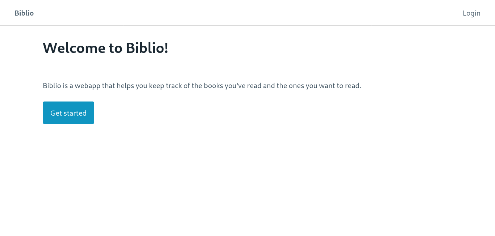
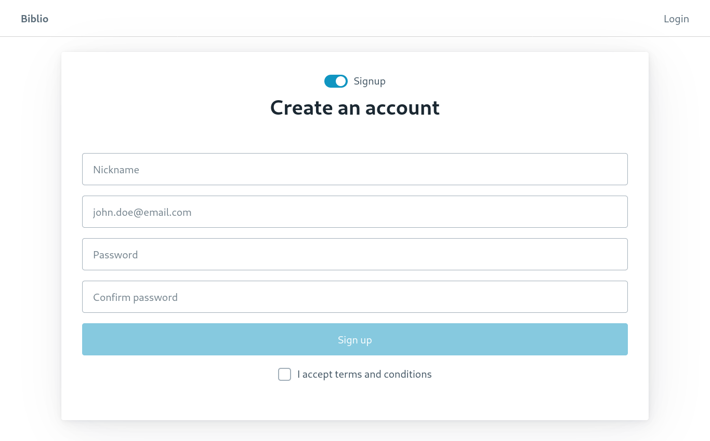
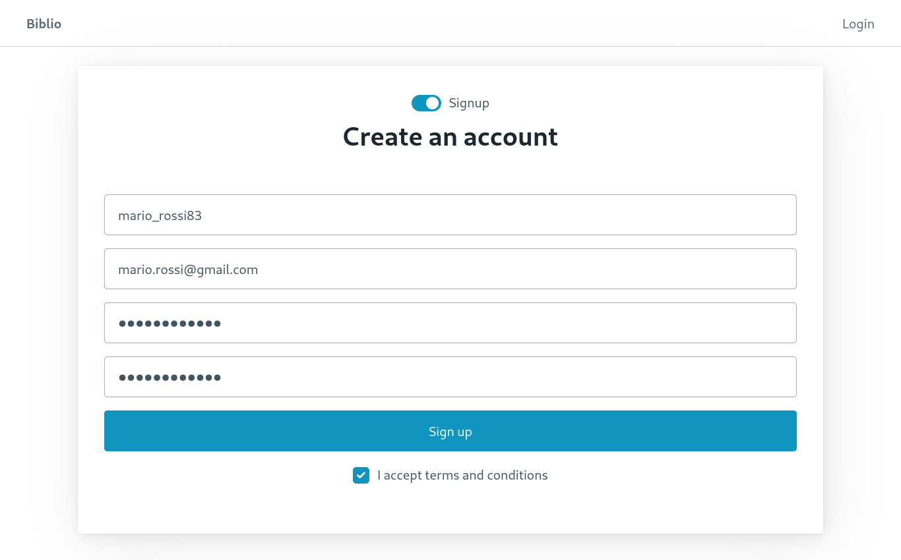
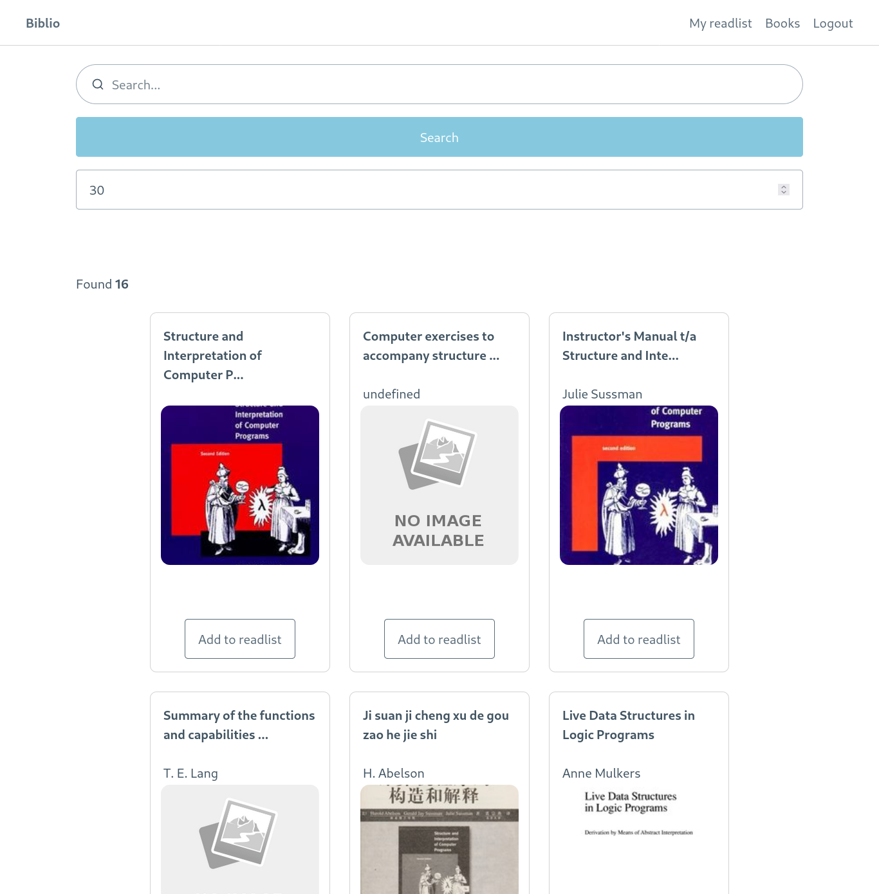
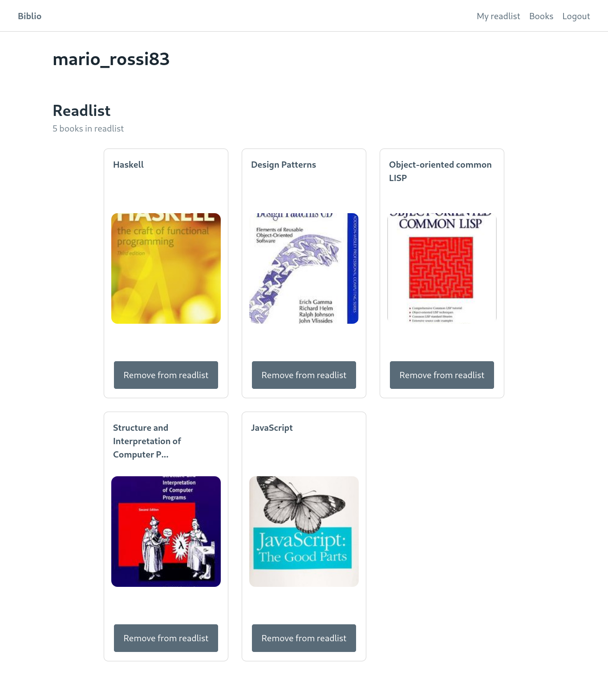
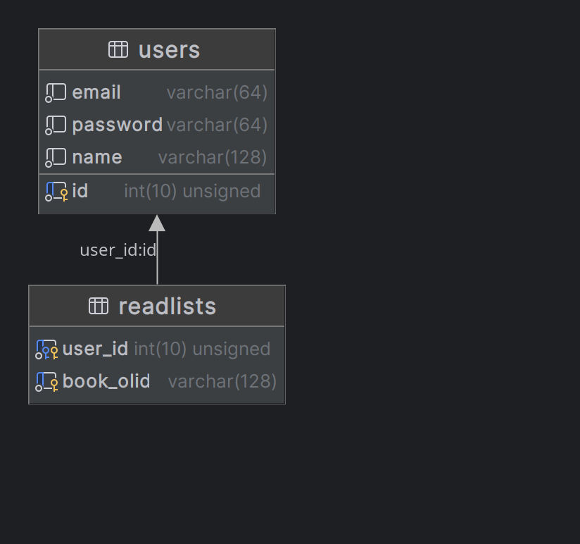

# Biblio

## Introduzione
**Biblio** è una webapp progettata per semplificare la gestione delle readlist, ovvero delle liste personali di libri da leggere. Gli utenti possono cercare i libri che desiderano aggiungere alla propria lista attraverso un sistema di ricerca intuitivo e facile da usare. La piattaforma mette a disposizione un vasto catalogo di libri (*Open Library*), ognuno dei quali è corredato da informazioni come titolo, autore, e copertina.

Gli utenti possono facilmente aggiungere i libri trovati alla loro lista personale e visionarli. La webapp offre anche la possibilità di eliminare i libri dalla lista, in caso l'utente non sia più interessato alla lettura di un determinato libro.

## Utilizzo
L'utente è accolto da una schermata di benvenuto da dove è possibile accedere al processo di **login** o **signup**.

Dopodichè la registrazione è abbastanza lineare:

Il **login** viene effettuato automaticamente dopo la registrazione. 

L'utente viene dopodiché reindirizzato alla pagina *Books* per effettuare una ricerca. Da quì possiamo cliccare su *Add to readlist* per aggiungere il libro alla readlist. 

Andando sulla pagina *My readlist* possiamo visionare i libri aggiunti.

Per sloggare l'utente basta cliccare su *Logout* nella navbar.

## Architettura
L'applicazione web è stata scritta utilizzando diverse tecnologie web. È stato utilizzato **Svelte.js**, un framework **JavaScript**, per rendere la scrittura del frontend più facilitata con l'utilizzo dei layout e i componenti riutilizzabili.
Per il CSS è stato utilizzato **pico.css**, una libreria CSS con dei componenti responsive già definiti. Sono stati comunque scritte classi CSS custom per casi di utilizzo particolari, come il componente *Book*. L'API di backend è stato scritto in **PHP**, un linguaggio di scripting open source molto popolare. Quest'ultimo si interfaccia a una base di dati **MariaDB**, una versione open source di *MySQL*. Infine, per automatizzare il deploy dell'applicazione, si è scelto di utilizzare **docker-compose**, facendo il build di un'immagine custom a partire da **php-apache**. Come server HTTP è stato scelto Apache.

**Apache HTTP Server**, comunemente chiamato Apache, è uno dei server web più popolari ed è stato utilizzato come server web per la biblio. In particolare, viene utilizzata l'immagine ufficiale di PHP con Apache, che permette di eseguire l'applicazione web utilizzando PHP e di esporla al mondo esterno tramite Apache.

### Backend
Per quanto riguarda il backend, è stato scelto il linguaggio di scripting **PHP**. Questo linguaggio è molto diffuso e ampiamente utilizzato per lo sviluppo di applicazioni web grazie alla sua semplicità di utilizzo e alla grande quantità di risorse disponibili in rete. Inoltre, PHP è in grado di interfacciarsi con le basi di dati attraverso il driver **PDO**, il che lo rende un'ottima scelta per il backend dell'applicazione.

Infine, per automatizzare il deploy dell'applicazione, è stato scelto **docker-compose**. Questo strumento consente di definire e gestire facilmente i container Docker per un'applicazione complessa, semplificando notevolmente il processo di deploy. In particolare, docker-compose consente di definire le diverse parti dell'applicazione (come il backend e il database) in un unico file YAML, rendendo molto più semplice la creazione dell'immagine Docker e il deploy dell'applicazione in un ambiente di produzione.

Il backend scritto in *php* segue il paradigma ORM, dove ogni tabella della base di dati viene mappata a una classe nel linguaggio di programmazione. La struttura del filesystem è la seguente:

    backend/
    ├── books.php
    ├── database.php
    ├── models
    │   ├── readlist.php
    │   └── user.php
    ├── readlists
    │   ├── book.php
    │   ├── create.php
    │   ├── delete.php
    │   ├── read_all.php
    │   └── read.php
    ├── search.php
    └── users
        ├── create.php
        ├── delete.php
        ├── login.php
        ├── read_all.php
        ├── read.php
        └── update.php

#### Modelli
La directory *models* contiene tutti i modelli. Ogni modello crea un'istanza della classe *Database* nel costruttore i questi.

##### readlist.php
- create
- read_all
- read
- read_by_book_olid - ritorna una coppia user_id-book_olid dando un *book_olid* come parametro
- user_has_book
- delete

##### user.php

- create
- read_all
- read
- get_by_email - ritorna i dati utente dando l'email di quest'ultimo come parametro 
- update
- delete

#### Endpoint
##### books
Serve da middleware per ricevere un determinato libro da Open Library.

    <?php 
    header("Access-Control-Allow-Origin: *");
    header('Content-Type: application/json');

    $url = "https://openlibrary.org/books/".$_GET["olid"].".json?";
    $data = json_decode(file_get_contents($url));

    if (!$data) {
        http_response_code(404);
        echo json_encode(array("message" => "Book not found."));
        exit;
    }

    $response = array(
        'key' => $data->key,
        'title' => $data->title,
        'author_name' => $data->authors[0]->key,
        'cover_i' => $data->covers[0]
    ); 

    http_response_code(200);
    echo json_encode($response);
    ?>

##### database
Questa classe definisce la connessione al server MariaDB:

    class Database
        {
        private $host = "mariadb";
        private $db_name = "biblio";
        private $username = "biblio";
        private $password = "biblio";
        public $conn;

        public function getConnection()
            {
            $this->conn = null;
            try
                {
                $this->conn = new PDO("mysql:host=" . $this->host . ";dbname=" . $this->db_name, $this->username, $this->password);
                $this->conn->exec("set names utf8");
                }
            catch(PDOException $exception)
                {
                echo "Errore di connessione: " . $exception->getMessage();
                }
            return $this->conn;
            }
        }

##### search
Questo endpoint serve da middleware per effettuare una ricerca con una query string a Open Library, ritornando un array di libri.

    <?php 
    header("Access-Control-Allow-Origin: *");
    header('Content-Type: application/json');

    $baseUrl = "https://openlibrary.org/search.json?";
    $query = http_build_query(array('q' => $_GET["query"]));

    $data = json_decode(file_get_contents($baseUrl.$query));

    // function book_test($book) {
    //     return
    //     $book->title != "undefined" ||
    //     $book->author_name != "undefined" ||
    //     $book->cover_i != "undefined";
    // }

    // array_filter($data->docs, "book_test");

    echo json_encode($data->docs);
    ?>

Vengono definiti gli endpoint per *user* e *readlist* all'interno delle omonime directory:

##### readlists
- book.php - ritorna un libro se l'utente inserito lo ha inserito nella sua readlist
- create.php - inserisce un libro con l'user_id specificato
- delete.php - rimuove il libro con il book_olid e user_id specificato
- read_all.php - ritorna tutti i record di readlists
- read.php

##### users
- create.php - inserisce un utente
- delete.php - rimuove un utente con lo user_id specificato
- login.php - esegue una serie di controlli e ritorna l'utente se l'oggetto inviato passa tutti i controlli di login
- read_all.php - ritorna tutti i record di users
- read.php - ritorna l'utente con lo user_id specificato
- update.php - modifica il record con lo user_id specificato

#### Docker
Per la gestione del database, è stato definito il servizio **mariadb** che utilizza l'immagine di *MariaDB* e espone la porta 3306. Inoltre, vengono specificati i parametri di configurazione, tra cui il nome del database, l'utente e la password. Il volume esterno **mariadb_data** viene utilizzato per memorizzare i dati del database in modo persistente.

Per la gestione dell'interfaccia di amministrazione del database, viene utilizzato **Adminer**, che espone la porta 8080.

Il servizio **PHP** è definito tramite il file **Dockerfile**, in cui viene utilizzata l'immagine di base *php:7.4-apache* e si installano le dipendenze necessarie per la connessione al database. Viene anche abilitato il supporto alle richieste CORS per consentire alle applicazioni Web di accedere alle risorse della piattaforma.

Infine, vengono definiti il mapping delle porte per consentire l'accesso all'applicazione Web e ai servizi esterni, e la rete utilizzata dai servizi.

##### docker-compose.yml
    version: '3'

    services:
    mariadb:
        image: mariadb:latest
        restart: always
        environment:
        MARIADB_DATABASE: 'biblio'
        MARIADB_ROOT_PASSWORD: 'biblio'
        MARIADB_USER: 'biblio'
        MARIADB_PASSWORD: 'biblio'
        ports:
        - '3306:3306'
        expose:
        - '3306'
        volumes:
        - mariadb_data:/var/lib/mysql
        networks:
        - network

    adminer:
        image: adminer
        restart: always
        ports:
        - 8080:8080
        expose:
        - '8080'
        networks:
        - network

    php:
        build: .
        environment:
        - 'CORS_ALLOW_ORIGIN=*'
        ports:
        - '8000:80'
        - '443:443'
        volumes:
        - ./backend:/var/www/html:Z
        depends_on:
        - mariadb
        networks:
        - network

    volumes:
    mariadb_data:
        external: true

    networks:
    network:

##### dockerfile
    FROM php:7.4-apache

    RUN apt-get update && apt-get upgrade -y \
        && apt-get clean && rm -rf /var/lib/apt/lists/*

    RUN docker-php-ext-install mysqli pdo pdo_mysql && docker-php-ext-enable mysqli \
        && a2enmod headers \
        && sed -ri -e 's/^([ \t]*)(<\/VirtualHost>)/\1\tHeader set Access-Control-Allow-Origin "*"\n\tHeader set Access-Control-Allow-Methods "GET,POST,PUT,DELETE,OPTIONS"\n\tHeader set Access-Control-Allow-Headers "Content-Type,Authorization,X-Requested-With"\n\tHeader set Access-Control-Allow-Credentials "true"\n\1\2/g' /etc/apache2/sites-available/*.conf

#### Base di dati (MariaDB)
Il design della base di dati è abbastanza semplice. Consiste in due tabelle *users* e *readlists*.

##### Users
La tabella *users* tiene conto dei dati utente con i seguenti attributi:
- id, int(10), **chiave primaria**
- email, varchar(64)
- password, varchar(64)
- name, varchar(128)

##### Readlists
La tabella *readlists* tiene conto di quali libri vengono aggiunti da quali utenti:
- user_id, int(10)
- book_olid, varchar(128)

La **chiave primaria** è **composta**, formata da *user_id* e *book_olid*.

### Frontend
Il frontend scritto in *svelte.js* utilizza la *fetch API* per eseguire le chiamate. La struttura del filesystem è la seguente:

    frontend
    ├── package.json
    ├── package-lock.json
    ├── README.md
    ├── src
    │   ├── app.css
    │   ├── app.html
    │   ├── lib
    │   │   ├── components
    │   │   │   ├── Book.svelte
    │   │   │   ├── Login.svelte
    │   │   │   ├── Logo.svelte
    │   │   │   ├── Navbar.svelte
    │   │   │   └── Signup.svelte
    │   │   └── images
    │   │       ├── form-cover.jpg
    │   │       ├── github.svg
    │   │       └── noimage.png
    │   ├── readlist.js
    │   ├── routes
    │   │   ├── account
    │   │   │   └── +page.svelte
    │   │   ├── books
    │   │   │   └── +page.svelte
    │   │   ├── +layout.svelte
    │   │   ├── +page.js
    │   │   ├── +page.svelte
    │   │   └── user
    │   │       └── +page.svelte
    │   ├── session.js
    │   └── user.js
    ├── static
    │   ├── favicon.png
    │   └── robots.txt
    ├── svelte.config.js
    └── vite.config.js

### PicoCSS
PicoCSS è una libreria **CSS** leggera e minimalista che offre una serie di componenti e stili predefiniti per la costruzione di interfacce utente. La sua filosofia è quella di offrire solo ciò che serve, senza introdurre pesanti framework o strumenti di sviluppo inutili. Inoltre, PicoCSS è altamente personalizzabile, il che significa che è possibile utilizzare solo i componenti di cui si ha bisogno, modificare i colori, le dimensioni e altri aspetti del design.

Nel caso dell'applicazione descritta, l'utilizzo di PicoCSS ha permesso di creare interfacce utente responsive e coerenti senza dover dedicare troppo tempo alla scrittura di stili personalizzati. Tuttavia, sono state comunque scritte classi CSS custom per casi di utilizzo particolari, come il componente **Book**. In questo modo, è stato possibile creare un design personalizzato per alcuni elementi dell'interfaccia senza dover rinunciare alla coerenza e alla leggibilità del codice.

Un esempio applicativo di PicoCSS può essere il seguente:

    <button
        on:click={() => {userHasBookHandler(); isAdded ? removeBook(user_id, key) : addBook(user_id, key)}}
        class={isAdded ? "secondary" : "secondary outline"}
        style="width: fit-content; align-self: center;"
        >{isAdded ? "Remove from readlist" : "Add to readlist"}
    </button>

dove vengono applicate delle classi preesistenti *secondary* o *secondary outline* di PicoCSS.

### Svelte.js
**Svelte.js** è un **framework** **JavaScript** moderno che consente di creare applicazioni web efficienti e veloci, grazie alla sua particolare architettura. A differenza di altri framework come React o Vue, Svelte esegue il rendering del codice durante la fase di compilazione, anziché durante l'esecuzione dell'applicazione. Ciò significa che, invece di generare un codice JavaScript complesso per manipolare il DOM durante l'esecuzione dell'applicazione, Svelte genera un codice JavaScript ottimizzato che si integra direttamente nell'HTML finale.

Svelte si basa sulla creazione di componenti riutilizzabili, che possono essere facilmente gestiti grazie alla sintassi dichiarativa e intuitiva. Inoltre, Svelte offre una vasta gamma di funzionalità avanzate, come la gestione dello stato dell'applicazione e la creazione di animazioni e transizioni fluide.

Una delle caratteristiche più interessanti di Svelte è la sua leggerezza: l'intero framework pesa solo pochi kilobyte e il codice generato è molto compatto, il che lo rende ideale per creare applicazioni web veloci e reattive. Inoltre, Svelte è compatibile con la maggior parte dei browser moderni e può essere utilizzato in modo efficace in combinazione con altre tecnologie web come CSS e HTML.

Svelte.js viene utilizzato in tutto il lato frontend per l'interpolazione di JavaScript e HTML e il riutilizzo di componenti. Si utilizza il **layout**, un componente template che viene caricato in ogni pagina, per renderizzare la **navbar**. Quest'ultima renderizza, a seconda dello stato di login dell'utente, certi link a differenza di altri. Ad esempio, se l'utente è loggato, la navbar renderizza i link *Books*, *My readlist*, *Logout*. Se non è loggato renderizza solo *Login*.

    

    <Navbar></Navbar>
    

        

        <main class='container' style="margin-top: 5rem;">
            <slot />
        </main>

            
Made by Gabriele Aloisio

    

#### Componenti
- Book - Card libro
- Login - UI di login
- Signup - UI di signup
- Navbar - navbar caricata

#### Sessione utente e localStorage
Per gestire la sessione di accesso dell'utente, vengono salvati nel *localStorage* i dati utente che servono all'applicazione (nome, email, id) e lo stato *loggedIn*:

    export function getSession() {
        return {
            loggedIn: localStorage.getItem('loggedIn'),
            id: localStorage.getItem('id'),
            email: localStorage.getItem('email'),
            name: localStorage.getItem('name')
        }
    }

    export function loginSession(user) {
        localStorage.setItem('loggedIn', true);
        localStorage.setItem('id', user.id);
        localStorage.setItem('email', user.email);
        localStorage.setItem('name', user.name);
    }

    export function logoutSession() {
        localStorage.clear();
        location.reload();
    }

### Fetch API
La **Fetch API** è un'interfaccia JavaScript per l'accesso e la manipolazione di risorse web attraverso le richieste HTTP. Consente di inviare richieste HTTP asincrone da un client web a un server web e di ricevere risposte dal server.

La Fetch API fornisce un'alternativa moderna al vecchio XMLHttpRequest (XHR) che è stato utilizzato per molti anni per l'interazione tra client e server web. La Fetch API è basata su Promises, una funzionalità introdotta in ES6, che semplifica notevolmente la gestione degli errori e la gestione asincrona del codice.

La Fetch API è costituita da un singolo metodo globale fetch(), che prende come argomento l'URL della risorsa da richiedere e restituisce una Promise che risolve in un oggetto Response che rappresenta la risposta del server. L'oggetto Response contiene metodi per accedere ai dati della risposta, come ad esempio il corpo della risposta.

La Fetch API supporta anche la configurazione di opzioni per la richiesta HTTP, come ad esempio i metodi HTTP (GET, POST, ecc.), le intestazioni della richiesta e i parametri della query. Inoltre, la Fetch API fornisce una gestione semplificata dei tipi di dati, come JSON e Blob.

un esempio di implementazione delle chiamate *fetch* è nel file **user.js**:

    export function getUser(id) {
        var url = new URL("http://localhost:8000/users/read.php");
        url.searchParams.append("id", id);

        return fetch(url).then((res) => {
            if (res.ok) {
                return res.json();
            } 

            else if (res.status === 404) {
                throw new Error("User does not exist");
            }
        });
    }

    export function getReadlist(user_id) {
        var url = new URL("http://localhost:8000/readlists/read.php");
        url.searchParams.append("user_id", user_id);

        return fetch(url).then((res) => {
            if (res.ok) {
                return res.json();
            } 
            
            else if (res.status === 404) {
                throw new Error("No books in readlist");
            }

            else if (res.status === 500) {
                throw new Error("Failed to retrieve records");
            }
        });
    }

    export function getBook(olid) {
        var url = new URL("http://localhost:8000/books.php");
        url.searchParams.append("olid", olid);

        return fetch(url).then((res) => {
            if (res.ok) {
                return res.json();
            } 
            
            else if (res.status === 404) {
                throw new Error("No book found");
            }
        });
    }
